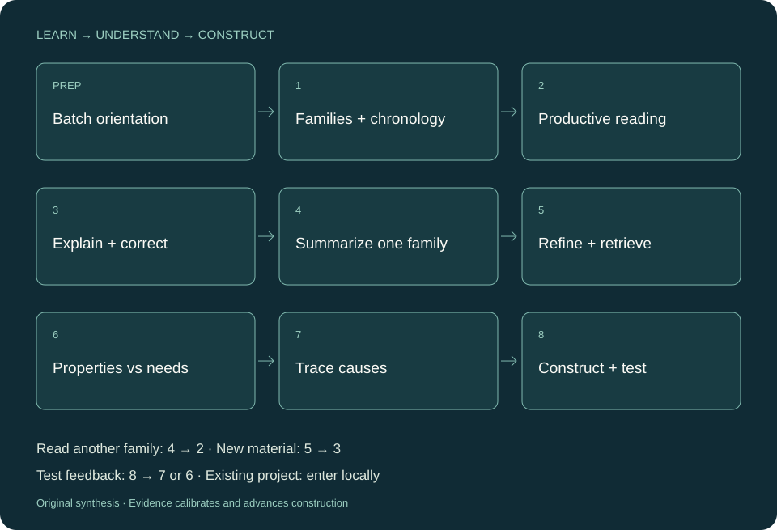

[](https://github.com/Ash-end/research-asterism/actions/workflows/validate.yml) [](LICENSE) [](https://github.com/Ash-end/research-asterism/releases/tag/v0.5.0)

# Research Asterism

可移植的 **research-methodology** 科研 Agent Skill。帮助研究者从一批材料中读懂方法家族、优势与限制的原因，再构造自己的具体候选方法，选择能推进判断的下一步检验。

[English](README.md) · [网站](https://ash-end.github.io/research-asterism/) · [开始使用](docs/GETTING-STARTED.md) · [十章原创指南](docs/HANDBOOK.md) · [评估](docs/EVALUATION.md) · [来源](SOURCES.md)

## 从当前节点开始

| 输入 | 主要工作 | 有用产物 |
| --- | --- | --- |
| 主题或论文集 | 批量初读，按家族与时间理解，追问优势和缺点原因 | 方法地图、具体阅读路线、问题修正 |
| 想法或待解决限制 | 放宽前提、避开失败原因、构造操作细节 | 方法候选、条件与成本、最近邻差异、最小检验 |
| 结果、证明或解释 | 核查实际测试的关系与适用范围 | 竞争解释、反例、继续／调整／停止条件 |

初学者可沿“准备 + 八步”走完整路线；已有研究可局部进入。第一性原理嵌在目标、机制、原因和构造中，证据核查帮助推进。只给一个主题也能开始，没有强制篇数、候选数量或多代理流程，不铺设重复记录体系。



## 三分钟开始

克隆公开仓库，然后在目标 Codex 项目中指定实际来源路径（Python3.10+仅用于离线辅助脚本）：

```powershell
git clone https://github.com/Ash-end/research-asterism.git
python 'C:\path\to\research-asterism\scripts\install_skill.py' --target '.agents\skills\research-methodology'
python 'C:\path\to\research-asterism\scripts\install_skill.py' --target '.agents\skills\research-methodology' --check
```

安装器复制11个运行时文件，拒绝覆盖已有目标，不调用网络或模型。新开宿主会话刷新发现。其他宿主可以读取 SKILL.md，但自动集成尚未在此认证。[详细安装方式](docs/GETTING-STARTED.md)。

```text
使用 $research-methodology。
我想理解一个领域，手头只有几篇摘要。帮我批量分出方法家族，
安排省力的阅读路线，解释优势和限制，再共同构造一个具体方法。
目前只讨论，不运行实验。
```

## 双表与具体构造

问题／应用需求表说明需要什么、为何重要；方法属性／性能表说明在什么条件下能做到什么。作者报告、条件推导、实测数值与待验证猜想分别标注。没有测量不能声称实测性能，却可以推导公式性质。未知、不可比较和已知失败有不同含义，两表不平均成科学总分。

构造要给输入、状态、操作或逻辑关系、输出、避开的原因、继承的优势、兼容条件、成本与新局限，随后给出不同预测和最小检验。经典方法足够时推荐它；模块组合和未检索到邻近工作都不证明新颖。[完整合成输入输出](docs/WORKFLOWS.md)。

## 证据与权限

区分来源事实、推断与待验证假设，引用要支撑具体条件下的主张。证明检查条件、依赖与反例。正负结果均限制贡献；干预未送达、预测中介未变、结局未变要靠独立事先定义的检查区分，不自动把失败称为无效测试。

检测当次可用工具，不绑定某个MCP。实验、数据、费用与公开权限来自当前任务，不自动启动旧研究、训练或付费工具，不承诺顶会。

## 实际评估和限制

旧v0.3.0有六例真实独立with/without开发比较，两个掩码评估者反转位置后偏好skill为4/6和3/6，其中两例结论不一致。v0.4系列主要是作者检查。v0.5.0真实新旧版比较覆盖10例；匿名正反位置审阅偏好新版／旧版／平局分别为1／1／8和2／2／6，未证明总体优于旧版，并保留新版初学者回答流程过多的问题。结果、原始答案、差异与局限见[当前评估](docs/EVALUATION.md)。这些小样本开发检验不是科研质量、广泛有效性或论文接收的证明。

```sh
python scripts/validate.py .
python scripts/verify_evaluation.py .
python -m unittest discover -s tests -v
```

这些离线命令校验结构、边界和历史字节，不验证科学新颖性。

## 原创与授权

MIT覆盖本仓库有权授权的原创实现、说明和图示。通用启发来自彭明辉的公开研究教学与维护者自建第一性原理技能；采用原创表达。14页二次改编PDF、原图、逐字全文、私密项目记录与领域配置不进入公开包。署名不表示原作者参与或背书；开源技能库仅用于借鉴组织与评估思路，星数不证明科研效果。[来源与许可证边界](SOURCES.md)。
